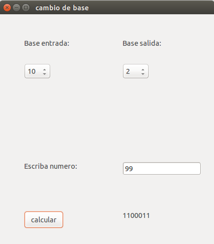

Cambio-de-base
==============

Este programa es capaz de realizar cambios de base, lo aplicamos sobre numeros naturales. Escribe letras mayusculas en la representación de bases >10.

**Instrucciones de compilación:**
```
g++ -o cambio_de_base interfaz.cpp `pkg-config --libs --cflags gtk+-2.0`
```

Existe una *interfaz grafica* en la cual el usuario introduce el numero en una base determianda y se le devuelve en la base deseada.  A continuacion mostramos un captura:
 
